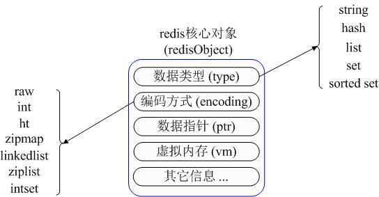
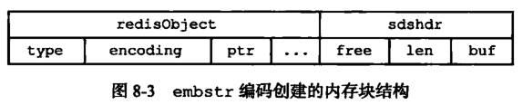
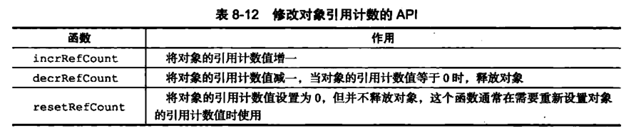
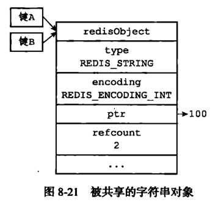
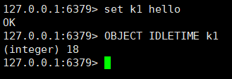

# Redis详解(5)--redis数据类型实现原理

在Redis中，并没有直接使用底层数据结构来实现**键值对数据库**，而是基于这些数据结构创建了一个**对象系统**，**这些对象系统也就是前面说的五大数据类型**，每一种数据类型都至少用到了一种数据结构。通过这五种不同类型的对象，Redis可以在执行命令之前，根据对象的类型判断一个对象是否可以执行给定的命令，而且可以针对不同的场景，为对象设置多种不同的数据结构，从而优化对象在不同场景下的使用效率。



</br>

## 对象的类型与编码

Redis使用前面说的五大数据类型来表示键和值，每次**在Redis数据库中创建一个键值对时**，至少会创建两个对象，一个是**键对象**，一个是**值对象**

**Redis中的每个对象**都是由 `redisObject `结构来表示：

```c
typedef struct redisObject{
     //类型
     unsigned type:4;
    
     //编码
     unsigned encoding:4;
    
     //指向底层数据结构的指针
     void *ptr;
    
     //引用计数
     int refcount;
    
     //记录最后一次被程序访问的时间
     unsigned lru:22;
}robj
```

**`type`属性：**

**对象的type属性**记录了**对象的类型**，这个类型就是前面讲的**五大数据类型**：

|     对象     | 对象type属性的值 | TYPE命令的输出 |
| :----------: | :--------------: | :------------: |
|  字符串对象  |   REDIS_STRING   |    "string"    |
|   列表对象   |    REDIS_LIST    |     "list"     |
|   哈希对象   |    REDIS_HASH    |     "hash"     |
|   集合对象   |    REDIS_SET     |     "set"      |
| 有序集合对象 |    REDIS_ZSET    |     "zset"     |

可以通过如下命令来判断对象类型：

```c
type key
```


**注意：在Redis中，键总是一个字符串对象，而值可以是字符串、列表、集合等对象，所以我们通常说的键为字符串键，表示的是这个键对应的值为字符串对象，我们说一个键为集合键时，表示的是这个键对应的值为集合对象。**

**`encoding`属性和`*prt`指针：**

对象的 `*prt` 指针**指向对象底层的数据结构**，而**数据结构由 `encoding` 属性来决定**。


而每种类型的对象都至少使用了两种不同的编码：


可以通过如下命令查看值对象的编码：

```
`OBJECT ENCODING    key `
```

比如 string 类型：（可以是 embstr编码的简单字符串或者是 int 整数值实现）


</br>

## String Object

**字符串是Redis最基本的数据类型**，不仅<u>所有key都是字符串类型，其它几种数据类型构成的元素也是字符串</u>。注意字符串的长度不能超过512M。

### 编码

字符串对象的编码可以是`int`、`raw`或者`embstr`

1. int 编码：保存的是可以用 long 类型表示的整数值
2. raw 编码：保存长度大于44字节的字符串（redis3.2版本之前是39字节，之后是44字节）
3. embstr 编码：保存长度小于44字节的字符串（redis3.2版本之前是39字节，之后是44字节）


由上可以看出，**int 编码是用来保存整数值**，**raw编码是用来保存长字符串**，而**embstr是用来保存短字符串**。其实 embstr 编码是专门用来保存短字符串的一种优化编码

**raw 和 embstr 的区别：**




embstr与raw都使用redisObject和sds保存数据，区别在于，embstr的使用只分配一次内存空间（因redisObject和sds是连续的），而raw需要分配两次内存空间（分别为redisObject和sds分配空间）。因此与raw相比embstr的好处在于创建时少分配一次空间，删除时少释放一次空间，以及对象的所有数据连在一起，寻找方便。embstr的坏处也很明显，如果字符串的长度增加需要重新分配内存时，整个redisObject和sds都需要重新分配空间，因此redis中的embstr实现为只读

**ps：Redis中对于浮点数类型也是作为字符串保存的，在需要的时候再将其转换成浮点数类型。**

### 编码转换

当 int 编码保存的值不再是整数，或大小超过了long的范围时，自动转化为raw。

对于 embstr 编码，由于 Redis 没有对其编写任何的修改程序（embstr 是只读的），在对embstr对象进行修改时，都会先转化为raw再进行修改，因此，只要是修改embstr对象，修改后的对象一定是raw的，无论是否达到了44个字节。

</br>

## List Object

　list 列表，它是简单的字符串列表，按照插入顺序排序，你可以添加一个元素到列表的头部（左边）或者尾部（右边），它的**底层实际上是个链表结构。**

### 编码

列表对象的编码可以是 **ziplist(压缩列表)** 和 **linkedlist(双端链表)**。 关于链表和压缩列表的特性

比如我们执行以下命令，创建一个 key = ‘numbers’，value = ‘1 three 5’ 的三个值的列表。

```sql
rpush numbers 1 "three" 5
```

**`ziplist` 编码表示如下：**


**linkedlist表示如下：**


### 编码转换

当同时满足下面两个条件时，使用ziplist（压缩列表）编码：

1. 列表保存元素个数小于512个
2. 每个元素长度小于64字节

不能满足这两个条件的时候使用 linkedlist 编码。

上面两个条件可以在redis.conf 配置文件中的 list-max-ziplist-value选项和 list-max-ziplist-entries 选项进行配置。

</br>

## hash Object

哈希对象的键是一个字符串类型，值是一个键值对集合。

### 编码

哈希对象的编码可以是 ziplist 或者 hashtable。

当使用ziplist，也就是压缩列表作为底层实现时，新增的键值对是保存到压缩列表的表尾。比如执行以下命令：

```sql
hset profile name "Tom"
hset profile age 25
hset profile career "Programmer"
```

如果使用ziplist，profile 存储如下：


当使用 hashtable 编码时，上面命令存储如下：


hashtable 编码的哈希表对象底层使用字典数据结构，哈希对象中的每个键值对都使用一个字典键值对。

在前面介绍压缩列表时，我们介绍过压缩列表是Redis为了节省内存而开发的，是由一系列特殊编码的连续内存块组成的顺序型数据结构，相对于字典数据结构，压缩列表用于元素个数少、元素长度小的场景。其优势在于集中存储，节省空间。

### 编码转换

和上面列表对象使用 ziplist 编码一样，当同时满足下面两个条件时，使用ziplist（压缩列表）编码：

1. 列表保存元素个数小于512个
2. 每个元素长度小于64字节

不能满足这两个条件的时候使用 hashtable 编码。第一个条件可以通过配置文件中的 set-max-intset-entries 进行修改

</br>

## Set Object

集合对象 set 是 string 类型（整数也会转换成string类型进行存储）的无序集合。注意集合和列表的区别：集合中的元素是无序的，因此不能通过索引来操作元素；集合中的元素不能有重复。

### 编码

集合对象的编码可以是 intset 或者 hashtable。

intset 编码的集合对象使用整数集合作为底层实现，集合对象包含的所有元素都被保存在整数集合中。

hashtable 编码的集合对象使用  字典作为底层实现，字典的每个键都是一个字符串对象，这里的每个字符串对象就是一个集合中的元素，而字典的值则全部设置为  null。这里可以类比Java集合中HashSet 集合的实现. HashSet 集合是由 HashMap 来实现的，集合中的元素就是  HashMap 的key，而 HashMap 的值都设为 null。

```sql
SADD numbers 1 3 5
```


```sql
SADD Dfruits "apple" "banana" "cherry"
```


### 编码转换

当集合同时满足以下两个条件时，使用 intset 编码：

1. 集合对象中所有元素都是整数
2. 集合对象所有元素数量不超过512

不能满足这两个条件的就使用 hashtable 编码。第二个条件可以通过配置文件的 set-max-intset-entries 进行配置。

</br>

## Zset Object

**有序集合对象是有序的**。与列表使用索引下标作为排序依据不同，<u>有序集合为每个元素设置一个分数（score）作为排序依据。</u>

有序集合的编码可以是 ziplist 或者 skiplist。

### 编码

ziplist 编码的有序集合对象使用压缩列表作为底层实现，每个集合元素使用两个紧挨在一起的压缩列表节点来保存，第一个节点保存元素的成员，第二个节点保存元素的分值。并且压缩列表内的集合元素按分值从小到大的顺序进行排列，小的放置在靠近表头的位置，大的放置在靠近表尾的位置。

```sql
ZADD price 8.5 apple 5.0 banana 6.0 cherry
```


skiplist 编码的有序集合对象使用 zset 结构作为底层实现，**一个 zset 结构同时包含一个字典和一个跳跃表：**

```c
typedef struct zset{
     //跳跃表
     zskiplist *zsl;
     //字典
     dict *dice;
} zset;
```

字典的键保存元素的值，字典的值则保存元素的分值；跳跃表节点的 object 属性保存元素的成员，跳跃表节点的 score 属性保存元素的分值。

这两种数据结构会通过指针来共享相同元素的成员和分值，所以不会产生重复成员和分值，造成内存的浪费。

说明：其实有序集合单独使用字典或跳跃表其中一种数据结构都可以实现，但是这里使用两种数据结构组合起来，原因是假如我们单独使用  字典，虽然能以 O(1)  的时间复杂度查找成员的分值，但是因为字典是以无序的方式来保存集合元素，所以每次进行范围操作的时候都要进行排序；假如我们单独使用跳跃表来实现，虽然能执行范围操作，但是查找操作有  O(1)的复杂度变为了O(logN)。因此Redis使用了两种数据结构来共同实现有序集合。

### 编码转换

当有序集合对象同时满足以下两个条件时，**对象使用 ziplist 编码：**

1. 保存的元素数量小于128；
2. 保存的所有元素长度都小于64字节。

不能满足上面两个条件的使用 skiplist 编码。以上两个条件也可以通过Redis配置文件zset-max-ziplist-entries 选项和 zset-max-ziplist-value 进行修改。

</br>

## 五大数据类型的应用场景

对于**string 数据类型**，因为string  类型是**二进制安全**的，可以用来**存放图片，视频等**内容，另外由于Redis的高性能读写功能，而**string类型的value也可以是数字，可以用作计数器（INCR,DECR）**，比如**分布式环境中统计系统的在线人数，秒杀**等。

对于 **hash 数据类型**，value 存放的是**键值对**，比如可以做**单点登录存放用户信息。**

对于 **list 数据类型**，可以实现**简单的消息队列**，另外可以**利用lrange命令，做基于redis的分页功能**

对于 **set 数据类型**，由于**底层是字典实现的**，查找元素特别快，另外set  数据类型中的**元素不允许重复**，利用这两个特性我们可以进行**全局去重**，比如在**用户注册模块，判断用户名是否注册；另外就是利用交集、并集、差集等操作，可以计算共同喜好，全部的喜好，自己独有的喜好等功能。**

对于 **zset 数据类型**，有序的集合，可以**做范围查找，排行榜应用**，取 TOP N 操作等。

</br>

## 内存回收和内存共享

### 内存回收

**前面讲 Redis 的每个对象都是由 redisObject 结构表示：**

```c
typedef struct redisObject{
     //类型
     unsigned type:4;
    
     //编码
     unsigned encoding:4;
    
     //指向底层数据结构的指针
     void *ptr;
    
     //引用计数
     int refcount;
    
     //记录最后一次被程序访问的时间
     unsigned lru:22;
}robj
```

其中关键的 type属性，encoding 属性和 ptr 指针都介绍过了，那么 refcount 属性是干什么的呢？

因为 C 语言不具备自动回收内存功能，那么该如何回收内存呢？于是 Redis自己构建了一个内存回收机制，通过在 redisObject 结构中的 refcount 属性实现。

这个属性会随着对象的使用状态而不断变化：

1. 创建一个新对象，属性 refcount 初始化为1
2. 对象被一个新程序使用，属性 refcount 加 1
3. 对象不再被一个程序使用，属性 refcount 减 1
4. 当对象的引用计数值变为 0 时，对象所占用的内存就会被释放。

在 Redis 中通过如下 API 来实现：



学过Java的应该知道，引用计数的内存回收机制其实是不被Java采用的，因为不能克服循环引用的例子（比如 A 具有 B 的引用，B 具有 C 的引用，C 具有 A 的引用，除此之外，这三个对象没有任何用处了），这时候 A B C 三个对象会一直驻留在内存中，造成内存泄露。那么 Redis 既然采用引用计数的垃圾回收机制，如何解决这个问题呢？

在前面介绍 redis.conf 配置文件时，在  MEMORY MANAGEMENT 下有个 maxmemory-policy 配置：

maxmemory-policy ：当内存使用达到最大值时，redis使用的清楚策略。有以下几种可以选择：

1. volatile-lru   利用LRU算法移除设置过过期时间的key (LRU:最近使用 Least Recently Used ) 
2. allkeys-lru   利用LRU算法移除任何key 
3. volatile-random 移除设置过过期时间的随机key 
4. allkeys-random  移除随机key
5. volatile-ttl   移除即将过期的key(minor TTL) 
6. noeviction  noeviction   不移除任何key，只是返回一个写错误 ，默认选项

通过这种配置，也可以对内存进行回收。

### 内存共享

refcount 属性除了能实现内存回收以外，还能用于内存共享。

比如通过如下命令 set k1 100,创建一个键为 k1，值为100的字符串对象，接着通过如下命令 set k2 100 ，创建一个键为 k2，值为100 的字符串对象，那么 Redis 是如何做的呢？

1. 将数据库键的值指针指向一个现有值的对象
2. 将被共享的值对象引用refcount 加 1



注意：Redis的共享对象目前只支持整数值的字符串对象。之所以如此，实际上是对内存和CPU（时间）的平衡：共享对象虽然会降低内存消耗，但是判断两个对象是否相等却需要消耗额外的时间。对于整数值，判断操作复杂度为O(1)；对于普通字符串，判断复杂度为O(n)；而对于哈希、列表、集合和有序集合，判断的复杂度为O(n^2)。

虽然共享对象只能是整数值的字符串对象，但是5种类型都可能使用共享对象（如哈希、列表等的元素可以使用）。

</br>

## 对象的空转时常

在 redisObject 结构中，前面介绍了 type、encoding、ptr 和 refcount 属性，最后一个 lru 属性，该属性记录了对象最后一次被命令程序访问的时间。

使用 OBJECT IDLETIME 命令可以打印给定键的空转时长，通过将当前时间减去值对象的 lru 时间计算得到。



lru 属性除了计算空转时长以外，还可以配合前面内存回收配置使用。如果Redis打开了maxmemory选项，且内存回收算法选择的是volatile-lru或allkeys—lru，那么当Redis内存占用超过maxmemory指定的值时，Redis会优先选择空转时间最长的对象进行释放。


