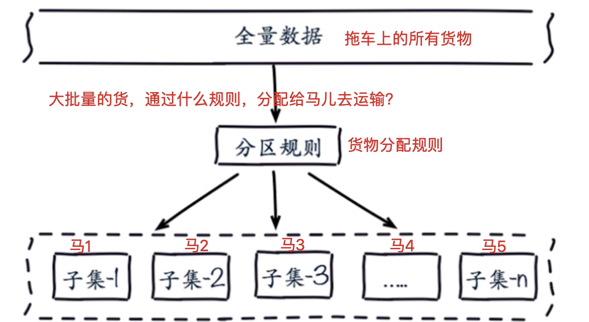
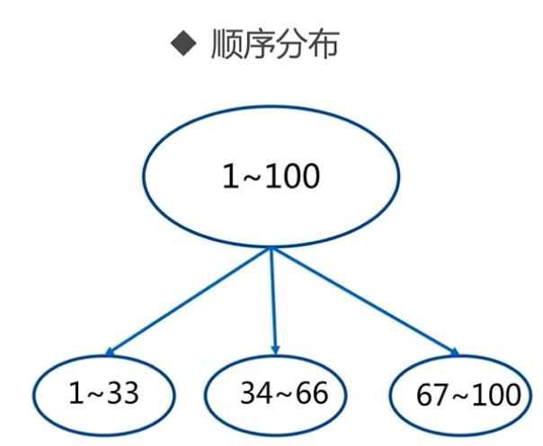
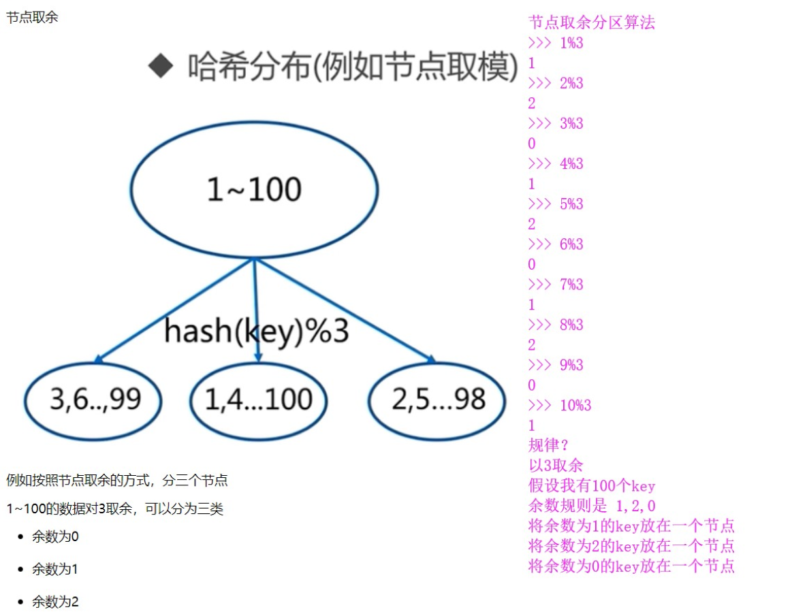
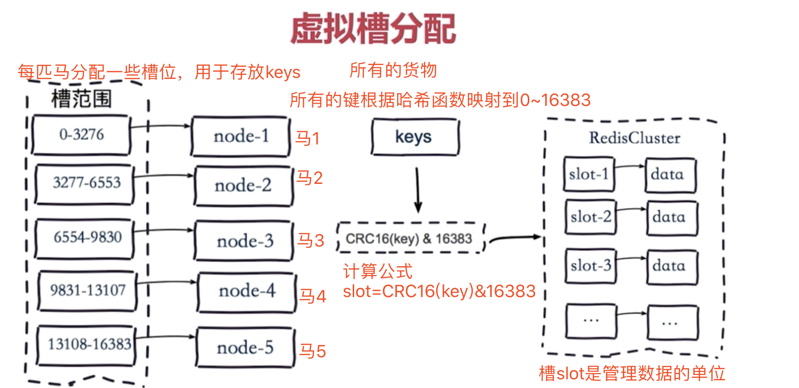
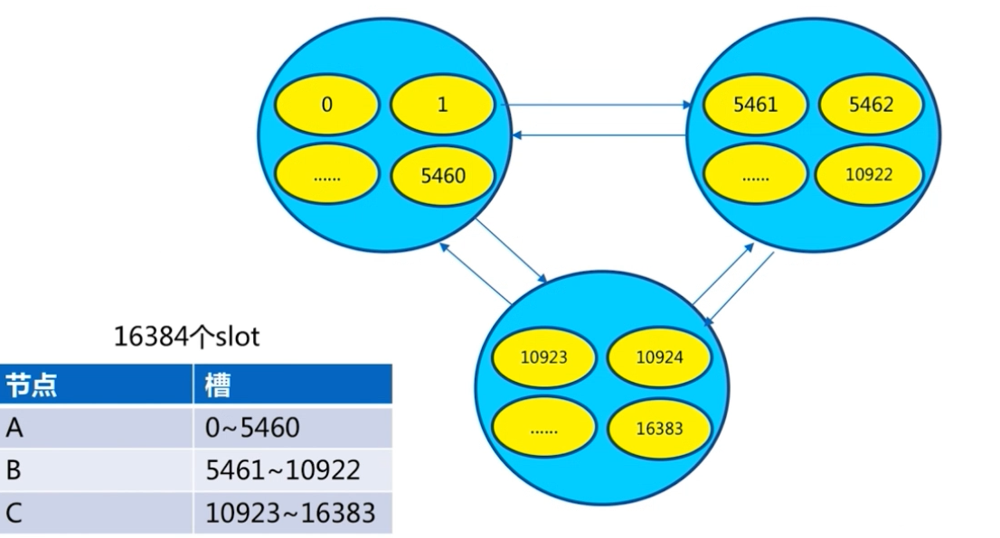
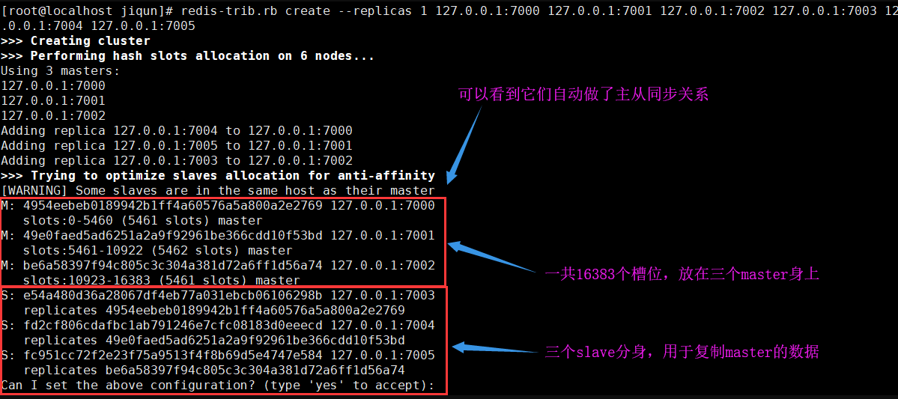
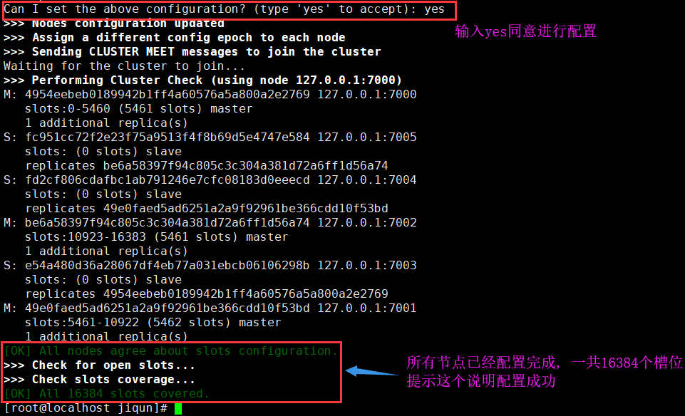

# Redis详解(8)--redis-cluster

## 为什么要用redis-cluster

1. 并发问题

   redis官方声称可以达到 10万/每秒,每秒执行10万条命令，假如业务需要每秒100万的命令执行呢？

2. 数据量太大

   一台服务器内存正常是16~256G，假如你的业务需要500G内存，

   新浪微博作为世界上最大的redis存储，就超过1TB的数据，去哪买这么大的内存条？各大公司有自己的解决方案，推出各自的集群功能，**核心思想**都是将**数据分片（sharding）存储在多个redis实例**中，**每一片就是一个redis实例**

   ```sql
   各大企业集群方案：
   twemproxy由Twitter开源
   Codis由豌豆荚开发，基于GO和C开发
   redis-cluster官方3.0版本后的集群方案
   ```

**解决方案：**

1. 配置一个超级牛逼的计算机，超大内存，超强cpu，但是问题是。。。。
2. 正确的应该是考虑**分布式**，加机器，把数据分到不同的位置，**分摊集中式的压力**，**一堆机器做一件事**

</br>

## 客户端分片

<mark>redis3.0集群采用P2P模式，完全去中心化，将redis所有的**key**分成了16384个**槽位**，每个redis实例负责一部分**slot**，集群中的所有信息通过节点数据交换而更新。</mark>

**redis实例集群**主要思想是**将redis数据的key进行散列**，通过hash函数，特定的key会映射到指定的redis节点上

### 数据分布原理



**分布式数据库**首要解决把整个**数据集按照分区规则映射到多个节点**的问题，即把数据集划分到多个节点上，每个节点负责整个数据的一个子集。

常见的分区规则有**哈希分区**和**顺序分区**。`Redis Cluster`采用**哈希分区**规则，因此接下来会讨论哈希分区规则

+ 顺序分区
+ 哈希分区
  + 节点取余分区
  + 一致性分区
  + **虚拟槽分区（redis-cluster采用的方式）**

#### 顺序分区



#### 哈希分区

**节点取余分区算法**



那么同样的分4个节点就是hash(key)%4

节点取余的优点是简单，客户端分片直接是哈希+取余

------

**一致性哈希算法：**客户端进行分片，哈希+顺时针取余

------

**虚拟槽分区算法：**

`Redis Cluster`采用**虚拟槽分区**

虚拟槽分区巧妙地使用了哈希空间，使用**分散度良好的哈希函数把所有的数据映射到一个固定范围内的整数集合，整数定义为槽（slot）**

**Redis Cluster槽的范围是0～16383**

**槽是集群内数据管理和迁移的基本单位。**采用大范围的槽的主要目的是为了方便数据的拆分和集群的扩展，**每个节点负责一定数量的槽。**




</br>

## 搭建redis-cluster

搭建集群分为几部

+  准备节点（几匹马儿）
+ 节点通信（几匹马儿分配主从）
+ 分配槽位给节点（slot分配给马儿）

redis-cluster集群架构

```
多个服务端，负责读写，彼此通信，redis指定了16384个槽。

多匹马儿，负责运输数据，马儿分配16384个槽位，管理数据。

ruby的脚本自动就把分配槽位这事做了
```




### 安装方式

官方提供通过ruby语言的脚本一键安装

#### 环境准备

通过配置，开启redis-cluster

```bash
port 7000
daemonize yes
dir "/opt/redis/data"
logfile "/opt/redis/logs/7000.log"
dbfilename "dump-7000.rdb"
cluster-enabled yes   # 开启集群模式
cluster-config-file nodes-7000.conf　　# 集群内部的配置文件
cluster-require-full-coverage no　　# redis cluster需要16384个slot都正常的时候才能对外提供服务，换句话说，只要任何一个slot异常那么整个cluster不对外提供服务。 因此生产环境一般为no
```

简洁配置：

```bash
port 7000
daemonize yes
dir "/opt/redis/data"
logfile "/opt/redis/logs/7000.log"
dbfilename "dump-7000.rdb"
cluster-enabled yes
cluster-config-file nodes-7000.conf
```

redis支持多实例的功能，我们在单机演示集群搭建，需要6个实例，三个是主节点，三个是从节点，数量为6个节点才能保证高可用的集群。

**每个节点仅仅是端口运行的不同！**

```bash
[root@yugo /opt/redis/config 17:12:30]#ls
redis-7000.conf  redis-7002.conf  redis-7004.conf
redis-7001.conf  redis-7003.conf  redis-7005.conf

#确保每个配置文件中的端口修改！！
```

#### 运行redis实例

创建6个节点的redis实例

```bash
1855  2018-10-24 15:46:01 redis-server redis-7000.conf
 1856  2018-10-24 15:46:13 redis-server redis-7001.conf
 1857  2018-10-24 15:46:16 redis-server redis-7002.conf
 1858  2018-10-24 15:46:18 redis-server redis-7003.conf
 1859  2018-10-24 15:46:20 redis-server redis-7004.conf
 1860  2018-10-24 15:46:23 redis-server redis-7005.conf
```

检查日志文件

```bash
cat 7000.log
```

检查redis服务的端口、进程

```bash
netstat -tunlp|grep redis

ps -ef|grep redis
```

**此时集群还不可用，可以通过登录redis查看**

```bash
redis-cli -p 7000
set hello world

(error)CLUSTERDOWN The cluster is down
# 提示槽位没有分配
```

#### 创建开启redis-cluster

**准备ruby环境：**

分配redis集群状态，以及槽位分配，互联网企业，豆瓣公司开源的一个工具

1. 下载、编译、安装Ruby
2. 安装rubygem redis
3. 安装redis-trib.rb命令

第一步，安装ruby(这些命令可以放入一个sh脚本文件里)

```bash
# 下载ruby
wget https://cache.ruby-lang.org/pub/ruby/2.3/ruby-2.3.1.tar.gz

# 安装ruby
tar -xvf ruby-2.3.1.tar.gz
cd ruby-2.3.1/
./configure --prefix=/opt/ruby/
make && make install

# 配置ruby的环境变量
vim /etc/profile
写入如下配置
PATH=$PATH:/opt/ruby/bin

# 准备一个ruby命令
# 准备一个gem软件包管理命令
# 拷贝ruby命令到path下/usr/local/ruby
cp /opt/ruby/bin/ruby /usr/local/
cp bin/gem /usr/local/bin
```

安装ruby gem包管理工具：

```bash
wget http://rubygems.org/downloads/redis-3.3.0.gem

gem install -l redis-3.3.0.gem

#查看gem有哪些包
gem list -- check redis gem
```

安装redis-trib.rb命令

```bash
[root@yugo /opt/redis/src 18:38:13]#cp /opt/redis/src/redis-trib.rb /usr/local/bin/
```

**一键开启redis-cluster集群：**

```bash
redis-trib.rb create --replicas 1 127.0.0.1:7000 127.0.0.1:7001 127.0.0.1:7002 127.0.0.1:7003 127.0.0.1:7004 127.0.0.1:7005

--replicas  # 表示进行身份授权
1  # 表示每个主节点，只有一个从节点

# 集群会自动分配主从关系  7000、7001、7002为主服务器master 7003、7004、7005为从服务器slave
```





#### 查看集群状态

```bash
redis-cli -p 7000 cluster info  

redis-cli -p 7000 cluster nodes  #等同于查看nodes-7000.conf文件节点信息

集群主节点状态
redis-cli -p 7000 cluster nodes | grep master
集群从节点状态
redis-cli -p 7000 cluster nodes | grep slave
```

安装完毕后，检查集群状态

```bash
[root@yugo /opt/redis/src 18:42:14]#redis-cli -p 7000 cluster info
cluster_state:ok
cluster_slots_assigned:16384
cluster_slots_ok:16384
cluster_slots_pfail:0
cluster_slots_fail:0
cluster_known_nodes:6
cluster_size:3
cluster_current_epoch:6
cluster_my_epoch:1
cluster_stats_messages_ping_sent:10468
cluster_stats_messages_pong_sent:10558
cluster_stats_messages_sent:21026
cluster_stats_messages_ping_received:10553
cluster_stats_messages_pong_received:10468
cluster_stats_messages_meet_received:5
cluster_stats_messages_received:21026
```

**测试写入集群数据，登录集群必须使用redis-cli -c -p 7000必须加上-c参数**

```bash
127.0.0.1:7000> set name tiger
-> Redirected to slot [5798] located at 127.0.0.1:7001       
OK
127.0.0.1:7001> exit
[root@yugo /opt/redis/src 18:46:07]#redis-cli -c -p 7000
127.0.0.1:7000> ping
PONG
127.0.0.1:7000> keys *
(empty list or set)
127.0.0.1:7000> get name
-> Redirected to slot [5798] located at 127.0.0.1:7001
"tiger"
```

**工作原理：**

redis客户端任意访问一个redis实例，如果数据不在该实例中，通过**重定向**引导客户端访问所需要的redis实例


